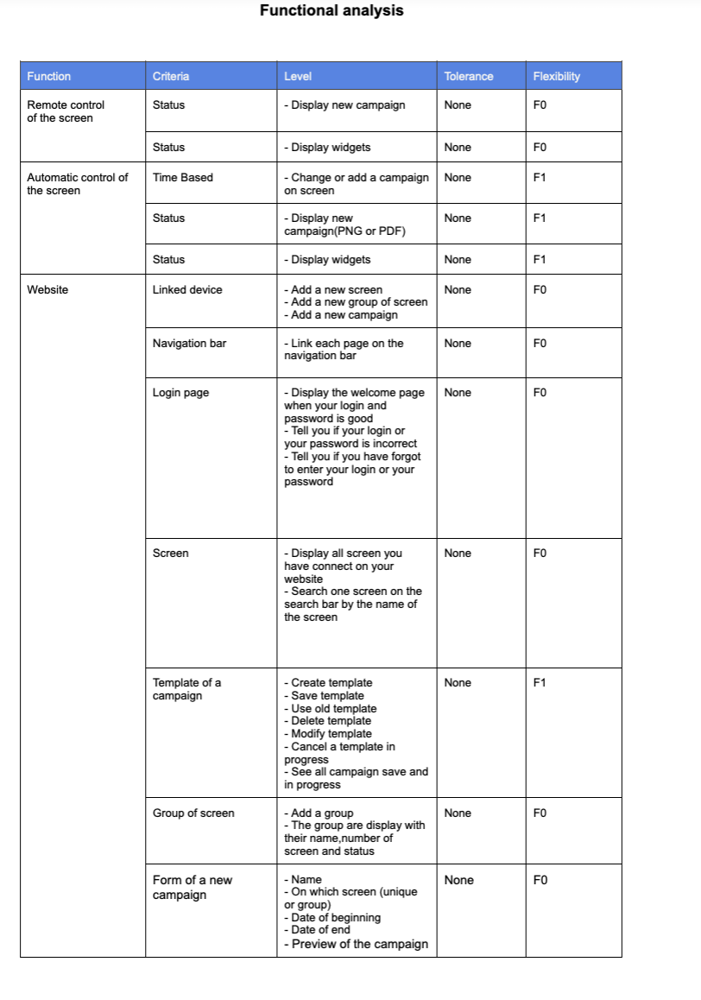

The author of this functional specification is **Robin Debry**
 
<h1 style="text-align: center">Project 1 smart signage project 4 group - Functional Specifications</h1>

 

Table of contents:

- [1. Introduction](#1-introduction)
- [2. Glossary:](#2-glossary)
- [3. Stakeholders:](#3-stakeholders)
  - [3.1. The sponsor:](#31-the-sponsor)
  - [3.2. The engineering team:](#32-the-engineering-team)
- [4. Monitoring screens in the factory:](#4-monitoring-screens-in-the-factory)
- [5. Remote control of screen in the factory:](#5-remote-control-of-screen-in-the-factory)
- [6. Personas:](#6-personas)
  - [6.1 Content Producer:](#61-content-producer)
    - [6.1.1. Michael:](#611-michael)
  - [6.2 Viewers:](#62-viewers)
    - [6.2.1. Bertrand:](#621-bertrand)
    - [6.2.2. Pierre:](#622-pierre)
    - [6.2.3. Akira:](#623-akira)
- [7. Out of scope:](#7-out-of-scope)
- [8. User cases:](#8-user-cases)
- [9. Functional analysis:](#9-functional-analysis)
- [10. The technology:](#10-the-technology)
- [11. Improvements for V2?](#11-improvements-for-v2)
  - [11.1 Software:](#111-software)
- [12. Non-functional requirements:](#12-non-functional-requirements)
  - [12.1 Cost:](#121-cost)
    - [12.1.1 Hardware:](#1211-hardware)
    - [12.1.2 Software:](#1212-software)
      - [Server Costs](#server-costs)
      - [Maintenance](#maintenance)
      - [Energy consumption](#energy-consumption)
  - [12.2 Security:](#122-security)
- [13. Conclusion:](#13-conclusion)

---  

## 1. Introduction 

Jacobi Group is world leader in purification solution of air and water, using Activated Carbon, Ion Exchange Resins and Mobile Filtration Units. With its factory in Forges industrial zone since 1956, it has a heritage of being the only French industry manufacturing this unique product and supplying customers like Veolia, Valeo, Honeywell and French Ministry of Defence to name a few.  
The factory in Vierzon is the oldest in the Group however one of the most successful thanks to a flexible and can-do approach.
Now the Jacobi group want to improve his management.
They contacted us to created this project to improve the management of the factory

## 2. Glossary:

- **Jacobi:** The company that we are working for.
- **GDPR:** The european law that protect the data of the people.
- **HTML:** (HyperText Markup Language) We use this language to create a web page. It is the skeleton of the page. We write all the content as well as its structure. It is the language that the browser understands.
- **CSS:** (Cascading Style Sheets) This language completes HTML. It allows to format and make more ergonomic the website. It is the flesh that embellishes the skeleton.
- **JS:** (JavaScript) It's an object-oriented scripting language. This means that we can make the elements that make up the website dynamic. It is the muscles and joints of the site.
- **Firebase:** It's a service that allows us to store data in the cloud. It is a database that is hosted on the internet. It is a service that allows us to store data in the cloud. It is a database that is hosted on the internet.
- **Stakeholders:** The people who are interested in the project.

## 3. Stakeholders:

During this project for Jacobi, there are 2 different kind of stakeholders.

### 3.1. The sponsor:

First of all, there is the client, at the beginning of the project it will be represented by Franck JEANNIN, but after it, it will be directly the sponsor: Jacobi.  

At Jacobi the aim is to become the most sustainable supplier in the industry. they put their all into their sustainability programmes and do everything we can to have a positive impact on our planet and environment. Their processes are refined so that we make use of any surplus energy, we invest in local communities across the globe, and they are constantly looking for ways to reduce our carbon footprint. They are proud to be a part of the Jacobi Group and they are committed to making a difference.   

The Jacobi team who works on this project is composed of:
- Project owner, Mr. Usman SAEED.
- Content creator, Mrs. Karen BLANQUE (HR Assistant), Mr. Pierre PAGE (HR Manager), Mr. Nicolas YVELIN (Factory Manager)
- Power user, Mrs. Karen Blanque
- On-site Installation Manager, Mr. Samuel NEVES (Maintenance Shop Manager)

### 3.2. The engineering team:

The second stakeholders type is the engineering team who will directly work on the development and the conception of the project. This team his made of 5 people:  
* Quentin CLEMENT as the project manager.
* Robin DEBRY as the program manager.
* Thomas PLANCHARD as the software engineer.
* Karine VINETTE as the tech lead.

## 4. Monitoring screens in the factory:

The most important part for Jacobi is the communication between the factory and the people who work there. It's for that they need a website to display some information by a screen to inform all of employees.  
The importance of the screens in the company is to inform the employees about the news of the company. 
The screens are used to display the news of the company, the weather, the time, the news of the world, the news of the factory, the news of the employees, the news of the canteen, the news of the meeting room, the news of the reception and the news of the locker room. Also you will have information if someone visiting the factory and it will be display for the good room  
The monitoring of the screen is the main point of the development of this project.  
The user will use an application connected to the others screens with a Wi-Fi connection.  
because of the GDPR, the user will have to log in to the application to be able to see the content of the screen.Also, the user can stay connected to the application without reconnect every time he wants to see or change the content of the screen.  
He should be able to see if the screen is on, if it is off, the actual connection of the screen (with Wi-Fi bar) and the time since the screen is connect (in hours and minutes).  
This function will really be an informative one, it has the role of informing the user of the status of the screen in real time.

## 5. Remote control of screen in the factory:

The importance of the remote control of the screen is to be able to change the content of the screen without having to go to the screen.  
Also, the user will be able to change the content of the screen without having to log everytime into the application.  
The user will be able to schedule the content of the screen for a precise day and a precise hour  

The remote control of the screen is the second parameter to consider during this project.  
The user will be able to manage the others screens via an application. The user will be able to change the campaign who want on the screen and choose for which screen he want to apply this campaign(one screen or multiple screen). 
The user will also be able to configure an automatic on/off time that he will be able to change at anytime with some precise hours.

This will be the interactive features between the screen and the user.

## 6. Personas:

### 6.1 Content Producer:

The content producer is the person who will create or/and implement the content of the screen.
He will be able to create a campaign and choose the content of the campaign.  

#### 6.1.1. Michael:
Michael has been the content creator of Jacobi since April 2022. He is 43 years old married with 2 children who are now adults. He loves sport and road trips with his husband during his free time. he lives in Bourges, he takes the train every morning and evening.  
His job is to recruit people in the company and he will produce some content to the others screen.  
He is a power user of the application and he will use it to manage the screen in the company. 
With these improvements, he will inform the workers of the company if there is a problem in the factory and he will be able to inform them of the new campaign of the company. 
Also with the website she will be able to know if a screen is on or off and if it is connected to the Wi-Fi.

### 6.2 Viewers:

The viewers are the people who will see the content of the screen.  

#### 6.2.1. Bertrand:

Bertrand is a technician at Jacobi since 2019. He is 32 years old, married and has 4 children, and lives in Méreau with them. He loves food and spending time with her friends.  
His job is to install and repair the machine in the factory. He also has to make control of every machine one time a month to know if it needs a reparation.  
Michel will have the role "Technician", he will be able to check if TV is on or not. With the website, he will be able to avoid this monthly intervention and he will only intervene if Michel sees that the TV has a problem and it needs to be repaired.  
It will reduce the frequency of his verification in the factory and will be able to replace the time lost with the Television to do other tasks.

#### 6.2.2. Pierre:

Pierre is a worker at Jacobi since 2019. He is 32 years old, married and has 1 child, and lives in Bourges with them. He loves sport.  
He work in the production part of the factory. He will see the content of the screen in the factory everyday.  
Also Pierre want to know if a customer is coming in the factory. He will be able to see it on the screen and he will be able to prepare the machine to produce the product that the customer want.  
He will also be able to see if there is a problem in the factory. 

#### 6.2.3. Akira:

Akira is a Japanese customer who is coming to visit the factory. She is 32 years old, married and has 1 child, and lives in Tokyo with them. She loves french food.  
She will come to visit the factory to see how the product is made. She will be able to see the content of the screen select by the content producer. She will have some places where she can't enter for privacy.  

## 7. Out of scope:
Due to time and resources constraints, these features might be included in the upcoming versions:
- Different languages for the website in the future
- Display the campaigns on the screen in Paris

## 8. User cases:

## 9. Functional analysis:

For this project to be considered done, we need to have at least the following specifications :

|Flexibility | importance                      |
| ---------- | ------------------------------- |
| F0         | mandatory                       |
| F1         | important (product performance) |
| F2         | secondary (nice to have)        |

## 10. The technology:

The hardware we will use is just a simple monitor. Moreover we need a little computer. 
The software we will use is a web application. this application will be related with the simple monitor with the help of a little computer.  

## 11. Improvements for V2?

### 11.1 Software:

The following step of this project is to create the application for the users to let them control a lot of screens. It will be improve in the following months.

## 12. Non-functional requirements:

### 12.1 Cost:

#### 12.1.1 Hardware:

The hardware is composed of a monitor and a little computer.  
The monitor is a 50" monitor with a resolution of 3840x2160 4K.  
The little computer is a micro PC 4K Wi-Fi 5 Gigabit Ethernet.  
The total cost of the hardware is €1856 including taxes because we need 2 screens and 2 little computers  

#### 12.1.2 Software:

##### Server Costs

The database we will use is Firebase. Firebase is free we will only pay the name domain is average €15  
The total cost of the server is €15/year  

##### Maintenance
- The monitor: Should be changed every 7/8 years but you have 2 years of guaranteed. 
- The mini computer: Should last at least 4 years. 

##### Energy consumption
Energy Consumption of the screen: 
0,147Wh, the screen will be on 24/24h so the energy consumption will be 0,147 KWh * 24h * 365 days = 1288.60 KWh for one year.  
The price of 1KWh is €0,1394 to have the total cost of a screen it's the price of 1KWh multiply by the number of KWh used for one year. 1288.60 KWh * €0,1394 = €179.63  
The total cost for one screen is €179.63 per years. 

### 12.2 Security:

- Following the GDPR, we will have to make sure that the data is not shared with anyone else than the user.  
- Availability: By using the Wi-Fi of the factory Jacobi with it we can ensure that the product will be available 24/7.
- Confidentiality/Privacy: All the passwords are encrypted.
- Traceability: we use a logging system that provides the modification made by the user and the date of the modification.

## 13. Conclusion:

In spite of the specifications transmitted by Jacobi, a lot of freedom was voluntarily left to us so that we could find ideas which they had not necessarily thought of.  

Thanks to the communication between the stakeholders we were able to imagine and develop a rich project in the image of ALGOSUP and Jacobi.  

<b><u>Author:</u></b>
Debry Robin

