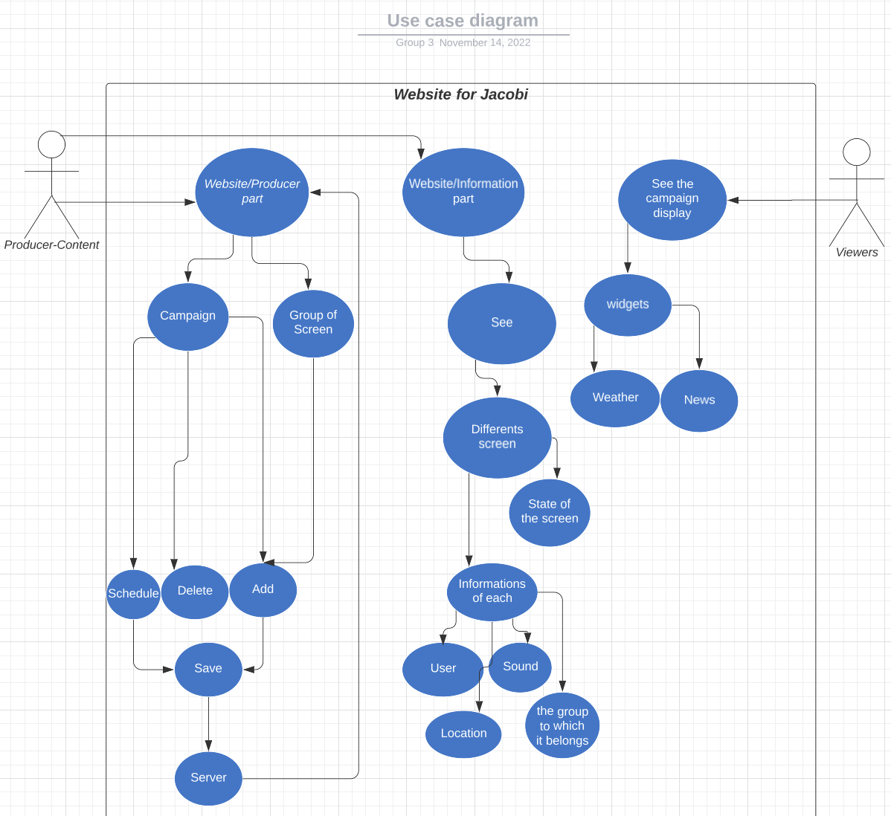
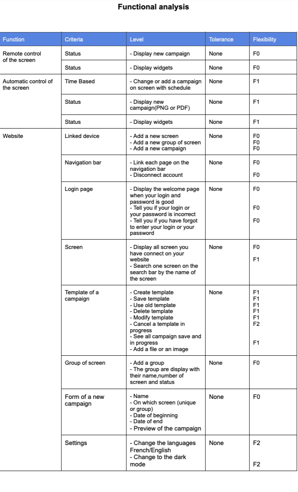

<h1 style="text-align: center">Project 1 smart signage project 3 group - Functional Specifications</h1>

 

Table of contents:

- [1. Introduction](#1-introduction)
- [2. Glossary](#2-glossary)
- [3. Stakeholders](#3-stakeholders)
  - [3.1. The sponsor](#31-the-sponsor)
  - [3.2. The engineering team](#32-the-engineering-team)
- [4. Functional Requirement](#4-functional-requirement)
  - [4.1. Account creation and login](#41-account-creation-and-login)
  - [4.2. Add a screen](#42-add-a-screen)
  - [4.3. Add a group of screens](#43-add-a-group-of-screens)
  - [4.4. Add a campaign](#44-add-a-campaign)
  - [4.5. Add a widget](#45-add-a-widget)
  - [4.6. Add a video](#46-add-a-video)
  - [4.7. Add a file](#47-add-a-file)
  - [4.8. Display the screen on the window](#48-display-the-screen-on-the-window)
- [5. Personas:](#5-personas)
  - [5.1 Content Producer](#51-content-producer)
    - [5.1.1. Michael](#511-michael)
    - [5.1.2. Christine](#512-christine)
  - [5.2 Viewers](#52-viewers)
    - [5.2.1. Bertrand](#521-bertrand)
    - [5.2.2. Pierre](#522-pierre)
    - [5.2.3. Akira](#523-akira)
- [6. Out of scope](#6-out-of-scope)
- [7. User cases](#7-user-cases)
- [8. Functional analysis](#8-functional-analysis)
- [9. The technology](#9-the-technology)
- [10. Improvements for V2](#10-improvements-for-v2)
  - [10.1 Software](#101-software)
- [11. Non-functional requirements](#11-non-functional-requirements)
  - [11.1 Cost](#111-cost)
    - [11.1.1 Hardware](#1111-hardware)
    - [11.1.2 Software](#1112-software)
      - [Server Costs](#server-costs)
      - [Maintenance](#maintenance)
      - [Energy consumption](#energy-consumption)
  - [11.2 Security](#112-security)
- [12. Conclusion](#12-conclusion)

--- 

## 1. Introduction 

Jacobi Group is the world leader in purification solutions for air and water, using Activated Carbon, Ion Exchange Resins, and Mobile Filtration Units. With its factory in Forge's industrial zone since 1956, it has a heritage of being the only French industry manufacturing this unique product and supplying customers like Veolia, Valeo, Honeywell, and the French Ministry of Defence, to name a few.  
The factory in Vierzon is the oldest in the Group. However, one of the most successful is thanks to a flexible and can-do approach.
Now the Jacobi group wants to improve its management.
They contacted us to create this project to improve the management of the factory.

## 2. Glossary

- **Jacobi:** The company that we are working for.
- **GDPR:** European law protects the data of the people.
- **HTML:** (HyperText Markup Language) We use this language to create a web page. It is the skeleton of the page. We write all the content as well as its structure. It is the language that the browser understands.
- **CSS:** (Cascading Style Sheets) This language completes HTML. It allows formatting and makes the website more ergonomic. It is the flesh that embellishes the skeleton.
- **JS:** (JavaScript) It's an object-oriented scripting language. This means that we can make the elements that make up the website dynamic. It is the muscles and joints of the site.
- **Firebase:** It's a service that allows us to store data in the cloud. It is a database that is hosted on the internet. It is a service that allows us to store data in the cloud. It is a database that is hosted on the internet.
- **Stakeholders:** The people who are interested in the project.

## 3. Stakeholders

During this project for Jacobi, there are two different kinds of stakeholders.

### 3.1. The sponsor

First of all, there is the client, at the beginning of the project it will be represented by Franck JEANNIN, but after it, it will be directly the sponsor: Jacobi.  

At Jacobi, the aim is to become the most sustainable supplier in the industry. They put their all into their sustainability programs and do everything they can to have a positive impact on our planet and environment. Their processes are refined so that we make use of any surplus energy, we invest in local communities across the globe, and they are constantly looking for ways to reduce our carbon footprint. They are proud to be a part of the Jacobi Group and they are committed to making a difference.   

The Jacobi team who works on this project is composed of:
- Project owner, Mr. Usman SAEED.
- Content creator, Mrs. Karen BLANQUE (HR Assistant), Mr. Pierre PAGE (HR Manager), Mr. Nicolas YVELIN (Factory Manager)
- Power-user, Mrs. Karen Blanque
- On-site Installation Manager, Mr. Samuel NEVES (Maintenance Shop Manager)

### 3.2. The engineering team

The second stakeholder type is the engineering team who will directly work on the development and the conception of the project. This team is composed of 5 people:  
* Quentin CLEMENT as the project manager.
* Robin DEBRY as the program manager.
* Thomas PLANCHARD as the software engineer.
* Karine VINETTE as the tech lead.

## 4. Functional Requirement

### 4.1. Account creation and login

We will have to create an account for the Jacobi employees.  

To do this, we will have to create a form with the following fields:
- First name
- Last name 
- Email
- Password
- Confirm password
  
For the Email, the employee needs to put a Jacobi email address.  

To do that, we need to:
- Add to the database the account created.
- Check the database if the account exists in the database.
- Display error messages if the login or the password is wrong or doesn’t exist.
- Display a validation message if the login and password are correct.
- Redirect correctly to the welcome page when the login and password are correct.

### 4.2. Add a screen

The user will be able to add a screen to the database and a list of screens on the website.  

To do that, we need to:
- Add to the database the screen created.
- Add on the website the screen created.
- Add the information on the screen on the database and the website.
- Display error messages if the screen already exists on the database.
- Redirect correctly to the welcome page when the screen is added.

### 4.3. Add a group of screens

The user will be able to add a group of screens to the database and the website.  

To do that, we need to:
- Add to the database the group of screens created.
- Add the information of the group of screens on the database and the website.
- Add the number of screens on the database and the website.

### 4.4. Add a campaign

The user will be able to add a campaign to the database and the website.  

To do that, we need to:
- Add on the database and on the website the campaign created.
- Add on the database and the website the information of the campaign.
- Select if you want to display the campaign on a unique screen or a group of screens.
- Select if you want to display the campaign on a unique hour, a day or a period.
- Select if you want to display a widget, a video, or a file (PDF, PNG).

### 4.5. Add a widget

The user will be able to add a widget to the screen.  

To do that we need to:
- Select "add a widget".
- Create the campaign with the widget.
- The image of the preview with the widget will be added to the database.

### 4.6. Add a video

The user will be able to add a video on the screen.  

To do that, we need to:
- Select "add a video".
- Create the campaign with the video.
- The image of the preview of the campaign and the video will be added to the database.

### 4.7. Add a file

The user will be able to add a file to the screen.  

To do that, we need to:
- Select add a file.
- Create the campaign with the file.
- The image of the preview of the file and the file will be added to the database.

### 4.8. Display the screen on the window

The user will be able to display the campaign on the screen.  

To do that, we need to:
- Create the campaign.
- When the campaign is created, the campaign is displayed on the screen at the time selected by the user.
## 5. Personas:

### 5.1 Content Producer

The content producer is the person who will create or/and implement the content on the screen.
He will be able to create a campaign and choose the content of the campaign.  

#### 5.1.1. Michael
Michael has been the content creator of Jacobi since April 2022. He is 43 years old, married with two children who are now adults. He loves sports and road trips with his husband during his free time. He lives in Bourges. He takes the train every morning and evening.  
His job is to recruit people in the company and he will produce some content for the other's screen.  
He is a power user of the application and he will use it to manage the screen in the company. 
With these improvements, he will inform the workers of the company if there is a problem in the factory and he will be able to inform them of the new campaign of the company. 
Also with the website he will be able to know if a screen is turned on or turned off and if the screen is connected to the Wi-Fi.

#### 5.1.2. Christine
Christine has been the CEO of Jacobi since January 2022 and she is 45 years old. She is married with four children who are now adults. She loves reading during her free time. She lives in Paris, she takes the train every morning and evening.  
Christine has an account for the website. With this when Michael is not here Christine will be able to create a campaign or add a new screen and see the status of them as Michael did. Christine will be happy because it can be useful to have one account for each person responsible for the Jacobi group with that if they are not here another responsible can tell some information to their workers  

### 5.2 Viewers

The viewers are the people who will see the content of the screen.  

#### 5.2.1. Bertrand

Bertrand has been a technician at Jacobi since 2019. He is 32 years old, married and has four children, and lives in Méreau with them. He loves food and spending time with her friends.  
His job is to install and repair the machine in the factory. He also has to take control of every machine one time a month to know if it needs repair.  
He will be able to check if TV is on or not. With the website, he will be able to avoid the intervention and he will only intervene if Michael or Christine sees that the TV has a problem and it needs to be repaired.  
It will reduce the frequency of his verification in the factory and will be able to replace the time lost with the Television to do other tasks.

#### 5.2.2. Pierre

Pierre has been a worker at Jacobi since 2012. He is 36 years old, married and has one child, and lives in Bourges with them. He loves sports.  
He works in the production part of the factory. He will see the content of the screen in the factory every day.  
Also, Pierre wants to know if a customer is coming to the factory. He will be able to see it on the screen and he will be able to prepare the machine to produce the product that the customer wants.  
He will also be able to see if there is a problem in the factory. 

#### 5.2.3. Akira

Akira is a Japanese customer who is coming to visit the factory. She is 49 years old, married and has one child, and lives in Tokyo with them. She loves french food.  
She will come to visit the factory to see how the product is made. She will be able to see the content of the screen selected by the content producer. She will have some places where she can't enter for privacy.  

## 6. Out of scope
Due to time and resources constraints, these features might be included in the upcoming versions:
- Different languages for the website in the future
- Display the campaigns on the screen in Paris

## 7. User cases

## 8. Functional analysis

For this project to be considered done, we need to have at least the following specifications :

|Flexibility | importance |
| ---------- | ------------------------------- |
| F0 | mandatory |
| F1 | important (product performance) |
| F2 | secondary (nice to have) |

## 9. The technology

The hardware we will use is just a simple monitor. Moreover, we need a little computer. 
The software we will use is a web application. This application will be related to the simple monitor with the help of a little computer.  

## 10. Improvements for V2

### 10.1 Software

The following step of this project is to create an application for the users to let them control many screens. It will be improved in the following months.

## 11. Non-functional requirements

### 11.1 Cost

#### 11.1.1 Hardware

The hardware is composed of a monitor and a little computer.  
The monitor is a 50" monitor with a resolution of 3840x2160 4K.  
The little computer is a micro PC with 4K Wi-Fi and 5 Gigabit Ethernet.  
The total cost of the hardware is €1856 including taxes because we need two screens and two little computers  

#### 11.1.2 Software

##### Server Costs

The database we will use is Firebase. Firebase is free we will only pay the name domain is average €15. 
The total cost of the server is €15/year. 

##### Maintenance
- The monitor: Should be changed every seven or eight years but you have two years of guarantee. 
- The mini-computer: Should last at least four years. 

##### Energy consumption
Energy Consumption of the screen: 
0,147Wh, the screen will be on 24/24h so the energy consumption will be 0,147 KWh * 24h * 365 days = 1288.60 KWh for one year.  
The price of 1KWh is €0,1394 to have the total cost of a screen. It's the price of 1KWh multiplied by the number of kWh used for one year. 1288.60 KWh * €0,1394 = €179.63  
The total cost for one screen is €179.63 per year. 

### 11.2 Security

- Following the GDPR, we will have to make sure that the data is not shared with anyone other than the user.  
- Availability: By using the Wi-Fi of the factory Jacobi with it we can ensure that the product will be available 24/7.
- Confidentiality/Privacy: All the passwords are encrypted.
- Traceability: we use a logging system that provides the modification made by the user and the date of the modification.

## 12. Conclusion

Despite the specifications transmitted by Jacobi, a lot of freedom was voluntarily left to us so that we could find ideas that they had not necessarily thought of.  

Thanks to the communication between the two stakeholders with it we were able to imagine and develop a rich project in the image of ALGOSUP and Jacobi.  

<b><u>Author:</u></b>
Debry Robin

